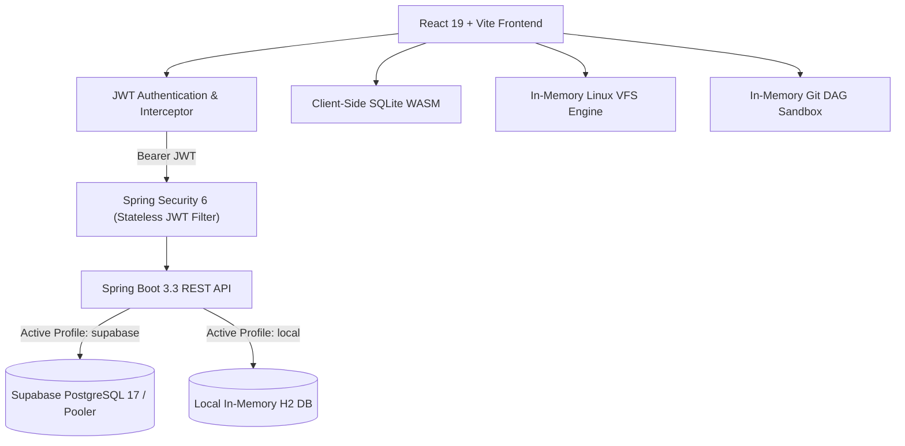

# 🚀 CommitDrive

> **Full-Stack Placement Engineering & Core CS Preparation Platform**  
> *Bridging the gap between static computer science theory and real-world software engineering placement interviews through hands-on browser sandboxes, scenario assessments, and targeted topic mastery.*

---

[](https://react.dev/)
[](https://spring.io/projects/spring-boot)
[](https://www.oracle.com/java/)
[](https://www.postgresql.org/)
[](https://supabase.com/)
[](https://jwt.io/)
[](https://vitejs.dev/)

---

## 🎯 The Problem

Engineering students and campus placement aspirants face a major hurdle during technical hiring drives:

1. **Rote Theory vs. Practical Reality**: College curricula focus on static slides and definitions, but top tier companies (FAANG, FinTech, Tier-1 Product firms) evaluate candidates on production scenarios: debugging Linux servers, diagnosing database bottlenecks, resolving Git merge conflicts, and architecting scalable systems.
2. **Scattered Resources**: Aspirants bounce between disparate sites for cheat sheets, practice terminals, company-specific hiring rubrics, and mock interviews.
3. **Lack of Measurable Readiness**: Without continuous tracking across both theoretical concepts and practical diagnostics, students have no objective measure of their placement readiness.

**CommitDrive solves this** by unifying structured core CS theory, interactive browser-native sandboxes, scenario-based mock assessments, and personalized readiness analytics into a single cohesive platform.

---

## ✨ Key Features

### 1. 📚 Structured Core CS Learning Path (30 Topics)
- **Deep Curriculum**: Covers 30 foundational CS topics across **Operating Systems**, **Database Management Systems (DBMS)**, **Computer Networks (CN)**, and **Practical Software Engineering**.
- **Interview-Enriched Modules**: Each topic is loaded with:
  - 60-second elevator pitch blueprints.
  - Common interviewer traps & watchouts.
  - Interactive flashcards & self-assessment quizzes.
  - Curated further reading & official engineering documentation links.
- **Company-Specific Interview Tracks**: Filter questions and rubrics tailored to **FAANG/Tier-1**, **FinTech**, or **Service/Mass Recruiters**.

### 2. 💻 Browser-Native Practical Path & Sandboxes
- **In-Memory Linux Virtual Shell**:
  - Full-featured virtual filesystem (VFS) simulating Linux kernel behavior.
  - Execute commands (`ls`, `cd`, `grep`, `find`, `sed`, `awk`, `chmod`, `ps`, `kill`, pipes `|`, and redirections `>`).
- **Interactive Git DAG Sandbox**:
  - Visual Directed Acyclic Graph (DAG) rendering of commit histories.
  - Real-time simulation of `git commit`, `git branch`, `git checkout`, `git merge`, and `git rebase` with interactive branch pointer animations.
- **WebAssembly Client-Side SQLite Studio**:
  - Real SQL database engine executing directly in the browser via WebAssembly (`sql.js`).
  - Schema explorer, table inspector, query execution, and placement challenge verification.
- **Scenario-Based Mock Assessments**:
  - Real-world production outage challenges, 3-attempt diagnostic unlock logic, and comprehensive explanations.

### 3. 🎯 Technical Viva & Keyword Feedback Evaluator
- **Written Technical Practice**: Practice answering core CS questions under timed or untimed conditions.
- **Rule-Based Keyword & Pattern Analysis**: Evaluates concept depth through deterministic keyword extraction, tracking covered core terms vs. missing placement concepts.
- **Rookie Trap Detection**: Automatically detects common interview pitfalls and rookie misconceptions, offering actionable guidance and model answers.
- **Company Rubric Alignment**: Calibrated evaluation criteria aligned with specific hiring tracks (FAANG/Product, FinTech, and Service).

### 4. 📊 Placement Readiness Engine & Dashboard
- **Dynamic Readiness Score**: Calibrated algorithm evaluating topic mastery, practical sandbox mission completion, and streak velocity.
- **Daily Streak Engine**: Tracks daily practice consistency to build placement discipline.
- **Global Leaderboard**: Compete with peer aspirants ranked by verified mastery points and streaks.

---

## 🛠️ Architecture & Tech Stack



### Frontend
- **Framework**: React 19, JavaScript (ESNext)
- **Tooling**: Vite 8, Oxlint
- **Icons & Styling**: Lucide React, Modern CSS Design System (Dark mode, glassmorphism, responsive micro-animations)
- **Client Sandboxes**: `sql.js` (WebAssembly SQLite), Canvas API (DAG Visualization)

### Backend
- **Runtime**: Java 17
- **Framework**: Spring Boot 3.3.4
- **Security**: Spring Security 6, Stateless JWT (`io.jsonwebtoken:jjwt 0.12.6`), BCrypt Password Hashing
- **Persistence**: Spring Data JPA, Hibernate ORM 6.5, HikariCP Connection Pooling
- **Configuration**: Dotenv Java (`io.github.cdimascio:dotenv-java`), Spring Profiles

### Database
- **Production / Cloud**: Supabase PostgreSQL 17 (via Transaction Session Pooler with SSL)
- **Local Fallback**: Embedded H2 Database for zero-setup offline development and automated testing

---

## 📁 Project Structure

```text
CommitDrive/
├── backend/
│   ├── src/
│   │   ├── main/
│   │   │   ├── java/com/commitdrive/
│   │   │   │   ├── config/          # Security, CORS & JPA configurations
│   │   │   │   ├── controller/      # REST API endpoints (Auth, Dashboard, Learning, Practical)
│   │   │   │   ├── dto/             # Request & Response Data Transfer Objects
│   │   │   │   ├── entity/          # JPA Entities (User, TopicProgress, PracticalProgress)
│   │   │   │   ├── repository/      # Spring Data JPA Repositories
│   │   │   │   ├── security/        # JWT Filter, Token Service & Authentication Entrypoint
│   │   │   │   └── service/         # Core business logic & score calculations
│   │   │   └── resources/
│   │   │       ├── application.properties           # Base Spring Boot config
│   │   │       ├── application-supabase.properties  # Cloud PostgreSQL profile
│   │   │       └── schema.sql                       # Database DDL schema & seed data
│   │   └── test/                                    # MockMvc & Security Integration Tests
│   ├── .env.example                                 # Backend environment template
│   └── pom.xml                                      # Maven project configuration
├── frontend/
│   ├── src/
│   │   ├── components/
│   │   │   ├── auth/            # Sign In / Sign Up modal & session management
│   │   │   ├── common/          # Modals, Navbar, Cram Sheet, Cursor Effects
│   │   │   ├── dashboard/       # Readiness metrics, streaks & progress overview
│   │   │   ├── learning/        # 30 CS topics reader, flashcards & Q&A
│   │   │   ├── practical/       # Linux VFS, Git DAG, SQLite & Mock test views
│   │   │   └── viva/            # Technical Viva evaluation modal
│   │   ├── data/                # Curriculum data, company tracks & virtual engines
│   │   ├── services/            # Axios/Fetch API client with JWT bearer interceptors
│   │   ├── App.jsx              # Main application shell & tab routing
│   │   └── index.css            # Global theme variables & typography
│   ├── package.json             # Frontend dependencies & scripts
│   └── vite.config.js           # Vite build configuration
└── supabase/
    └── schema.sql               # Production PostgreSQL schema for Supabase
```

---

## 🚦 Getting Started & Local Setup

### Prerequisites
- **Node.js**: `v18.0.0` or higher
- **JDK**: `Java 17` or higher
- **Maven**: `3.8+` (or use `./mvnw`)
- **Git**

---

### Step 1: Clone the Repository
```bash
git clone https://github.com/Srimaha02/CommitDrive.git
cd CommitDrive
```

---

### Step 2: Configure & Run the Backend

You can run the backend in **Local In-Memory Mode** (zero setup required) or **Supabase PostgreSQL Mode**.

#### Option A: Zero-Config Local Mode (H2 Database)
Simply start the backend with the default or `local` profile:
```bash
cd backend
mvn spring-boot:run -Dspring-boot.run.profiles=local
```
*The backend starts at `http://localhost:8080`. H2 Console is available at `http://localhost:8080/h2-console`.*

#### Option B: Supabase Cloud PostgreSQL Mode
1. In the `backend/` folder, copy the example environment file:
   ```bash
   cp .env.example .env
   ```
2. Populate `.env` with your Supabase connection parameters and a secure JWT secret:
   ```env
   SPRING_PROFILES_ACTIVE=supabase
   SUPABASE_DB_URL=jdbc:postgresql://<your-pooler-or-db-host>:5432/postgres?sslmode=require
   SUPABASE_DB_USER=postgres.<your-project-ref>
   SUPABASE_DB_PASSWORD=your_supabase_password_here
   COMMITDRIVE_JWT_SECRET=your_32_character_or_longer_jwt_secret_key_here
   CORS_ALLOWED_ORIGINS=http://localhost:5173
   ```
3. Run the backend:
   ```bash
   mvn spring-boot:run
   ```

#### Run Automated Backend Tests:
```bash
mvn test
```

---

### Step 3: Run the Frontend

1. Open a new terminal and navigate to `frontend/`:
   ```bash
   cd frontend
   ```
2. Install dependencies:
   ```bash
   npm install
   ```
3. Launch the Vite development server:
   ```bash
   npm run dev
   ```
4. Open your browser and navigate to:
   ```
   http://localhost:5173
   ```

---

## 🔒 Security & Best Practices

- **Strict Environment Separation**: No database passwords or private JWT secrets are committed to version control. Production and staging secrets are injected dynamically via `.env` or system environment variables.
- **Stateless Authorization**: All protected endpoints (`/api/learning/**`, `/api/practical/**`, `/api/dashboard/**`) require a valid `Bearer <token>` verified via Spring Security filter chain.
- **Password Protection**: User passwords are cryptographically hashed using **BCrypt** with automatic salt generation before persistence.
- **CORS Hardening**: Explicit origin validation allows requests exclusively from configured frontend hosts (`localhost:5173`, `localhost:3000`).

---

## 🤝 Contributing

Contributions are welcome! Please feel free to open issues or submit pull requests:

1. Fork the Project
2. Create your Feature Branch (`git checkout -b feature/AmazingFeature`)
3. Commit your Changes (`git commit -m 'feat: Add AmazingFeature'`)
4. Push to the Branch (`git push origin feature/AmazingFeature`)
5. Open a Pull Request

---

## 📄 License

Distributed under the **MIT License**. See `LICENSE` for more information.

---

<p align="center">
  <b>CommitDrive</b> — Built with passion for engineering placement excellence.
</p>
